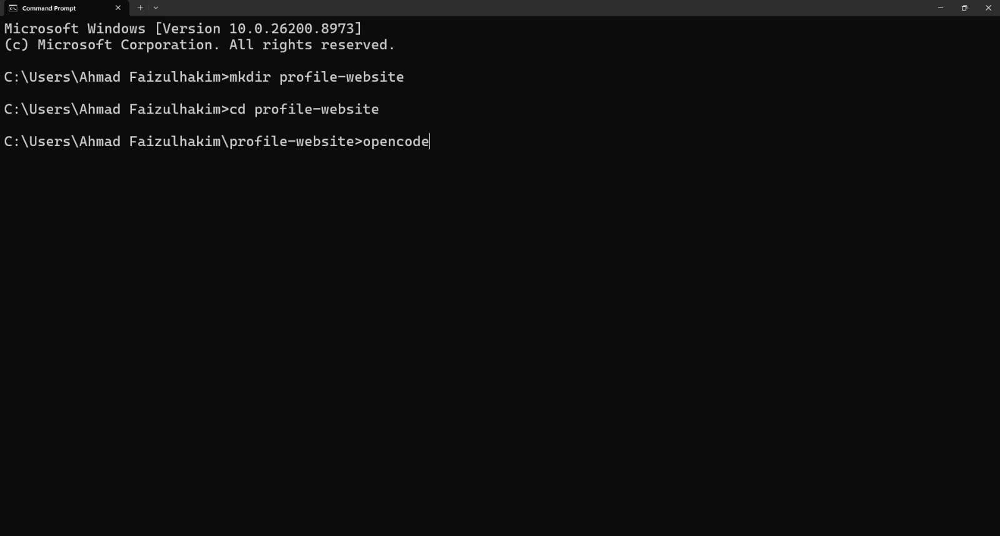
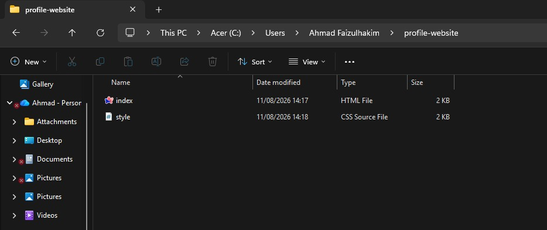
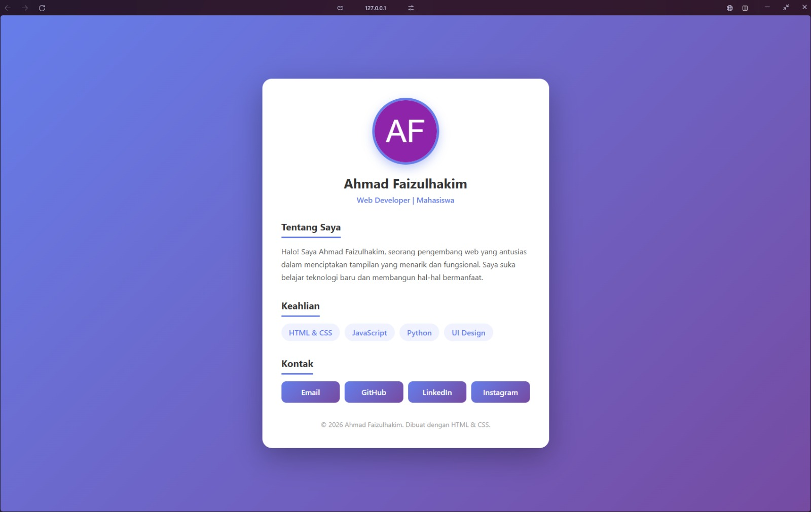

# Belajar Bikin Prototype dengan OpenCode

## Apa itu OpenCode?

OpenCode adalah **AI coding agent** yang berjalan di terminal. Bedanya dengan AI chat biasa: OpenCode bekerja langsung di dalam folder proyek kamu, bisa membaca file, menulis kode, dan menjalankan perintah. Kamu cukup ketik instruksi, lalu AI yang mengerjakan dan menyimpan hasilnya sebagai file beneran di komputer kamu. Bayangkan seperti "teman ngoding" yang bisa langsung mengedit kode di laptop kamu.

## Yang Kamu Butuhkan

- [OpenCode Zen](https://opencode.ai/zen)
- [OpenCode](https://opencode.ai)
- [Node.js](https://nodejs.org) & npm (untuk menjalankan perintah instalasi)

## Langkah 1

Buka terminal kamu dan instal OpenCode dengan menjalankan perintah berikut:

```bash
npm install -g opencode
```


## Langkah 2

OpenCode menggunakan gateway API bawaan bernama OpenCode Zen. Meskipun menggunakan model gratis, kamu tetap memerlukan API Key untuk autentikasi awal.

Buka browser dan kunjungi situs resmi OpenCode (opencode.ai).

Masuk ke halaman dasbor Zen.


Tekan tombol Get started with Zen.

Daftarkan akun baru atau login jika sudah memiliki akun.


Salin (copy) API Key yang tersedia di halaman tersebut.


## Langkah 3

Setelah OpenCode terinstal dan API Key sudah disalin, langkah selanjutnya adalah menghubungkannya ke proyek kamu.

Buka terminal lalu jalankan perintah:

```bash
opencode
```


Lalu ketik Ctrl+P untuk mengatur provider. Masuk ke Connect Provider lalu cari OpenCode Zen.


Pilih dan paste API Key dari website OpenCode yang sudah kamu copy sebelumnya.


Pilih model berlabel gratis agar tidak ada penagihan atau pemotongan saldo.

Cari dan pilih model gratis dari daftar. Model gratis biasanya memiliki akhiran `-free`.


## Langkah 4

Setelah model diatur, AI assistant sudah aktif sepenuhnya. Kamu bisa langsung memberikan instruksi seperti biasa.

Sebelum mulai membuat file, buat folder khusus untuk proyek kamu agar file yang dihasilkan tidak tercecer di direktori yang salah. Jalankan perintah berikut di terminal (Windows):

```bash
mkdir profile-website
cd profile-website
opencode
```

Penjelasan:

- `mkdir profile-website` → membuat folder baru bernama `profile-website`.
- `cd profile-website` → berpindah ke folder tersebut.
- `opencode` → membuka OpenCode dari dalam folder itu, jadi semua file yang dibuat akan tersimpan di `profile-website`.

Jika muncul error **"folder sudah ada"**, artinya nama `profile-website` pernah dipakai. Solusinya:

- Rename folder lama, misal `profile-website-lama`, lalu buat ulang dengan `mkdir profile-website`.
- Atau ganti nama folder baru, misal `mkdir profile-website-v2`, lalu `cd profile-website-v2`.



## Langkah 5

Sekarang OpenCode sudah terbuka di dalam folder `profile-website`. Berikan instruksi untuk membuat website. Contoh prompt:

```
buatkan tampilan sebuah website halaman profile dengan html dan css
```


Tunggu hingga OpenCode selesai membuat file.


Hasilnya akan tersimpan sebagai `index.html` di dalam folder `profile-website`.

Untuk melihat hasil file yang sudah dibuat:

1. Buka File Explorer, lalu masuk ke folder tempat kamu menyimpan proyek, contoh:
   `C:\Users\NamaKamu\profile-website`
   
2. Cari file `index.html`.
3. Double-click file tersebut untuk membukanya di browser bawaan.
4. Website profile personal kamu sudah jadi dan siap dilihat.



Lanjut ke [Sesi 2: Menggunakan Google Gemini sebagai Agent AI](02-gemini-api-dan-cli).
