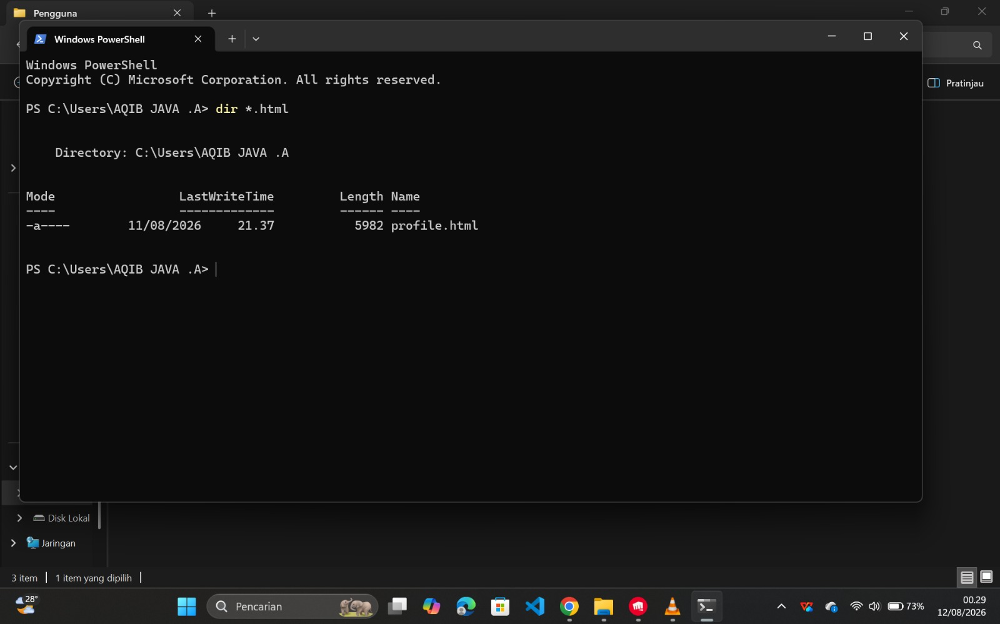
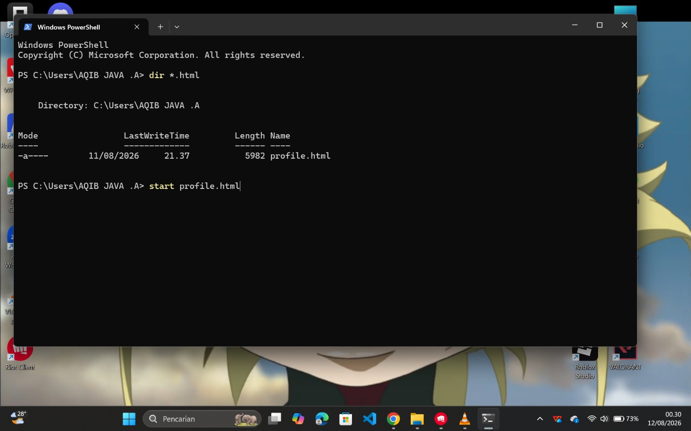

# Menggunakan Google Gemini sebagai Agent AI

## Apa itu Google Gemini?

**Gemini** adalah model AI buatan Google. Di sesi ini kamu memakai Gemini lewat dua hal:

- **API Key**: semacam "karcis" untuk memakai Gemini lewat alat lain. Diambil gratis dari Google AI Studio.
- **Gemini CLI**: program terminal yang menghubungkan kamu langsung ke model Gemini. Bisa menulis dan menyimpan file (misalnya HTML) ke folder kerja kamu.

Jadi di sesi ini Gemini dipakai sebagai *agent*: kamu kasih instruksi di terminal, Gemini mengerjakannya dan menyimpan hasilnya sebagai file.

## Yang Kamu Butuhkan
- Akun Google yang aktif.
- Koneksi internet yang stabil.
- Terminal / Command Prompt / Windows PowerShell.
- [Node.js](https://nodejs.org/) terinstal di komputermu (untuk menjalankan perintah `npm`).

## Langkah 1: Mendapatkan API Key dari Google AI Studio

Buka browser dan akses situs Google AI Studio (`aistudio.google.com`). Klik tombol **Get started**.


Pada halaman utama (dashboard), temukan dan klik menu **Get API key** di bagian sebelah kiri.


Di halaman API Keys, klik tombol **Create API key** untuk mulai membuat token baru.


Masukkan nama untuk kunci API kamu (contoh: "API javski") dan pastikan "Default Gemini Project" terpilih, lalu klik **Create key**.


Selesai! API Key kamu berhasil dibuat. Klik tombol **Copy key** untuk menyalinnya. *(Catatan: Jaga kerahasiaan token ini, pastikan saat melampirkan screenshot ke dokumen publik bagian kuncinya sudah diblur).*

.png>)

## Langkah 2: Instalasi dan Penggunaan Gemini CLI

Buka dokumentasi resmi instalasi Gemini CLI untuk melihat perintah instalasi via `npm`.


Buka Windows PowerShell atau Terminal kamu. Ketikkan perintah `npm install -g @google/gemini-cli` lalu tekan Enter. Tunggu beberapa saat hingga proses instalasi paket selesai.


Setelah berhasil terinstal, ketik perintah `gemini` dan tekan Enter untuk menjalankan CLI. Jika muncul kotak peringatan keamanan *"Do you trust the files in this folder?"*, gunakan tanda panah dan tekan enter atau ketik angka `1` untuk memilih opsi **Trust folder**.


Gemini CLI akan memuat ulang (restarting). Setelah itu, kamu bisa langsung berinteraksi dengan AI di terminal. Cobalah mengetik pesan pertama, misalnya `> hi`, dan Gemini akan langsung merespons!


## Langkah 3: Membuat File HTML dengan Gemini CLI

Setelah berhasil chat dengan Gemini di terminal, kamu bisa langsung meminta Gemini membuat dan menyimpan file HTML ke folder kerja kamu. Ikuti langkah-langkah berikut:

Pastikan kamu masih berada di sesi Gemini CLI (ditandai dengan prompt `>`). Ketikkan perintah untuk meminta halaman HTML.

Contoh prompt:
```
> can you make me simple html for an individual profile
```


Tekan **Enter** dan tunggu beberapa saat. Gemini akan berpikir dan memberikan saran (pilih yang sesuai), lalu menulis file `profile.html` langsung ke folder aktif kamu. Pada output biasanya akan muncul pesan konfirmasi seperti *"File created successfully at: .../index.html"*.


Verifikasi bahwa file benar-benar terbuat. Keluar dulu dari Gemini CLI dengan mengetik `/quit` lalu tekan Enter, atau buka terminal/PowerShell baru. Setelah itu jalankan perintah:

```
dir *.html
```

Perintah ini akan menampilkan semua file berekstensi `.html` di folder kerja kamu. Pastikan `profile.html` ada di daftar.



Atau kamu bisa cek sendiri melalui File Explorer tempat kamu membuka terminal tadi, default-nya akan berada di `C:\users\nama_pengguna\`.


Buka file HTML di browser. Cara paling cepat dari PowerShell adalah dengan perintah:

```
start index.html
```

Browser default kamu (Chrome/Edge/Firefox) akan otomatis terbuka dan menampilkan halaman HTML yang baru dibuat.



Atau kamu bisa langsung buka file HTML tersebut melalui File Explorer seperti yang dijelaskan di langkah sebelumnya. Selamat, kamu sudah berhasil membuat website statis tanpa menulis kode sendiri!


### Tips Lanjutan
- **Minta revisi:** buka lagi `gemini` di folder yang sama, lalu ketik `> tambahkan section kontak dengan form nama dan email di bagian bawah index.html`. Gemini akan memperbarui file secara langsung.
- **Ganti tema/warna:** `> ubah warna utama index.html menjadi biru laut (#0a2540)`.
- **Lihat isi file di terminal:** `> tampilkan isi index.html` (berguna kalau mau copy sebagian kode).
- **Minta file tambahan:** `> buatkan juga style.css terpisah lalu simpan ke file style.css`, lalu hubungkan ke HTML dengan `<link rel="stylesheet" href="style.css">`.

## Error yang Mungkin Muncul
- **Error: `npm command not found` (Teks merah di PowerShell)**
  - *Penyebab:* Node.js belum terinstal di laptop, atau path environment belum terkonfigurasi.
  - *Solusi:* Download [Node.js](https://nodejs.org/) dari situs resminya, instal, lalu tutup dan buka kembali terminalmu.
- **Peringatan: `Skipping project agents due to untrusted folder` saat buka Gemini CLI**
  - *Penyebab:* Sistem keamanan Gemini CLI memblokir eksekusi dari folder yang belum dipercaya.
  - *Solusi:* Pilih menu `1. Trust folder (NAMAFOLDER)` pada prompt dialog yang muncul di terminal.
- **File HTML tidak muncul di folder setelah minta dibuatkan**
  - *Penyebab:* Prompt tidak menyebutkan secara eksplisit "simpan ke file", sehingga Gemini hanya menampilkan kode di terminal tanpa menulis file.
  - *Solusi:* Ulangi prompt dengan frasa eksplisit, misal `> simpan kode tadi ke file index.html`. Periksa juga apakah kamu menjalankan `dir` di folder yang sama dengan sesi Gemini CLI.
- **Browser menampilkan kode HTML mentah, bukan halaman visual**
  - *Penyebab:* File dibuka sebagai teks biasa (ekstensi salah atau dibuka via editor, bukan browser).
  - *Solusi:* Pastikan file berekstensi `.html` (bukan `.txt`), lalu jalankan `start nama-file.html` dari PowerShell di folder yang sama, atau klik kanan → *Open with* → pilih browser.
- **Error dari OpenCode (Timeout/Not Found)**
  - *Penyebab:* Koneksi ke 9Router terputus atau nama model `oc/` yang dimasukkan salah.
  - *Solusi:* Cek ulang apakah `localhost:20128` bisa dibuka, dan pastikan ejaan model benar.

Lanjut ke [Sesi 3: Pengenalan 9Router: Rolling Token Gratisan](03-9router-dan-opencode).
