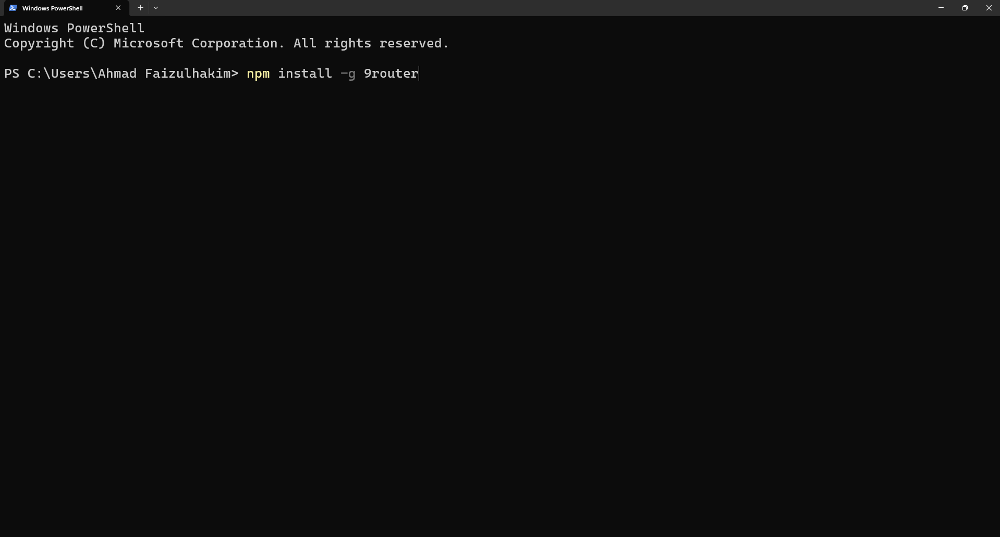
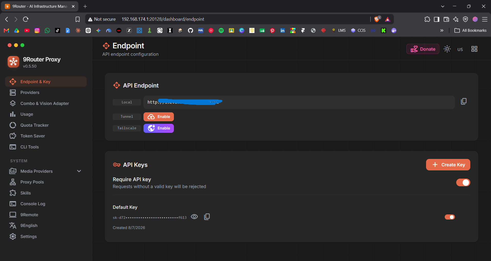
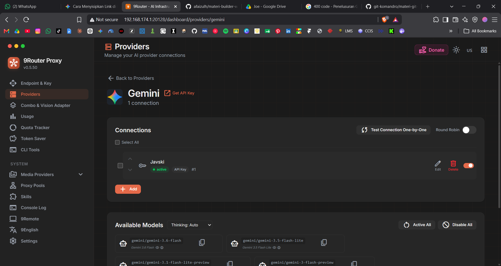
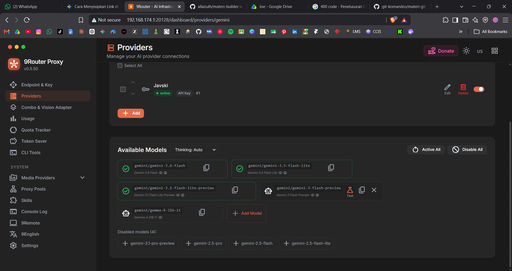
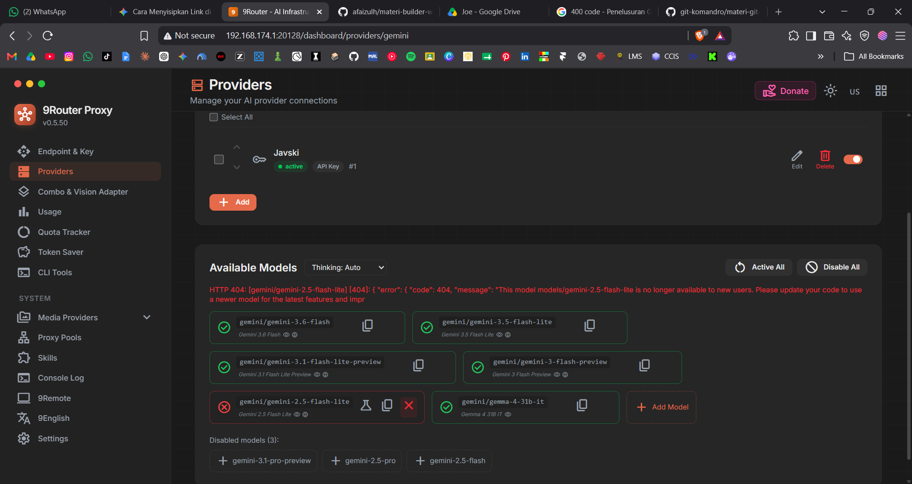
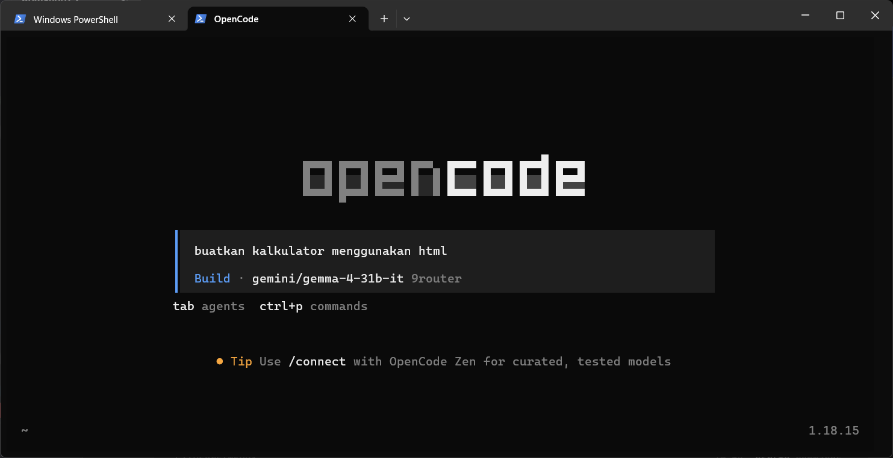
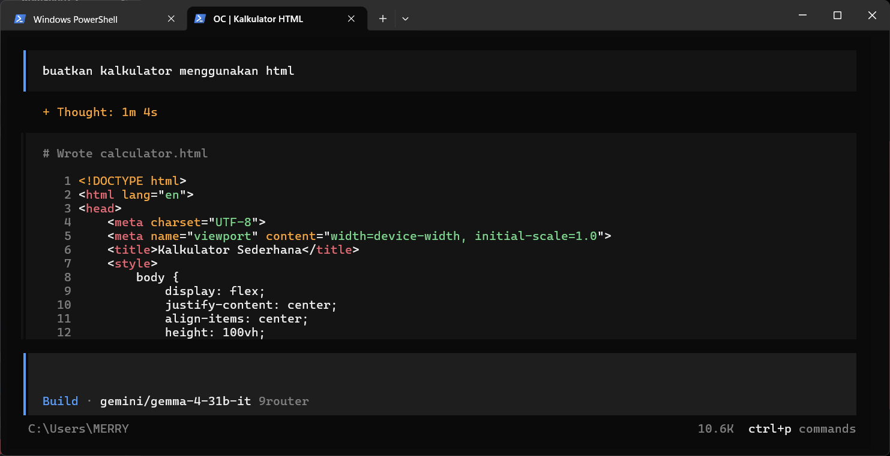

# Pengenalan 9Router: Rolling Token Gratisan

## Apa itu 9Router?

**9Router** adalah *router* lokal yang menyatukan banyak penyedia (provider) AI gratis ke **satu alamat endpoint dan satu API Key**. Jadi kamu tidak perlu memasang satu-satu key untuk tiap provider. Kalau satu provider kena batas (limit/rate limit), 9Router bisa otomatis pindah ke provider lain yang masih jalan. Dashboard-nya dibuka lewat browser di komputer kamu, dan di situlah kamu memilih provider (misalnya Gemini) yang dipakai oleh alat-alat lain seperti OpenCode.

## Yang Kamu Butuhkan

- [9Router](https://9router.com)
- [OpenCode](https://opencode.ai)
- [Node.js](https://nodejs.org) & npm (untuk menjalankan perintah instalasi)

## Langkah 1

Buka terminal atau command prompt kamu. Install 9router secara global dengan menjalankan perintah berikut:

```bash
npm install -g 9router
```



Setelah instalasi selesai, buka dashboard melalui browser di alamat `localhost:20218`.


Login menggunakan default password.


## Langkah 2

Buka halaman Endpoint & Key. Copy API Endpoint local dan API Keys.



Setelah itu buka halaman Providers. Scroll hingga ke bagian Free tier Providers. Pilih Gemini. Sambungkan dengan API dari Provider dan pilih Model yang ingin digunakan.






Apabila ada yang error cukup tekan silang.



Masuk ke CLI Tools. Masukkan local Endpoint serta API Key. Lalu pilih model yang ingin digunakan, contohnya Gemma 4 31B IT. Pencet Apply.


## Langkah 3

Install OpenCode dengan menjalankan perintah:

```bash
npm i -g opencode-ai
```


Setelah instalasi selesai, ketik opencode pada CLI untuk membuka UI OpenCode.

Karena konfigurasi provider (endpoint dan API Key) sudah di-setup otomatis oleh 9Router di Langkah 2 lewat menu CLI Tools, kamu **tidak perlu Connect Provider lagi** di OpenCode. Langsung lanjut ke Langkah 4.

## Langkah 4

Berikan perintah pada OpenCode untuk membuat sebuah tampilan aplikasi. Setelah selesai, masuk ke dalam file yang berisi kode yang sudah dibuat oleh OpenCode. Jalankan kode tersebut untuk melihat hasilnya.





## Jika Mau Menggunakan OpenCode via Visual Studio Code

Buka tab Extension dan cari OpenCode. Tekan install dan tunggu hingga proses instalasi selesai.

Setelah selesai, tekan Ctrl + J untuk membuka OpenCode. Masukkan perintah yang kamu inginkan lalu enter. OpenCode akan menjalankan perintah tersebut.


## Error Yang Mungkin Muncul

- Error gagal instalasi OpenCode dan 9Router akibat belum memiliki Node.js

- Proses pembuatan aplikasi dengan AI Assistant terganggu akibat sinyal tidak stabil

Lanjut ke [Sesi 4: Mencoba Agent LLM Freebuff](04-freebuff).
