# Mencoba Agent LLM Freebuff

## Apa itu freebuff?

**freebuff** adalah AI agent (LLM) yang bisa membuat kode **tanpa perlu API Key atau token sama sekali**. Cukup daftar dan login (pakai akun Google atau GitHub), lalu kamu bisa langsung minta bikin file lewat perintah. freebuff tersedia dalam tiga bentuk: **CLI** (dari terminal, butuh Node.js), **Desktop** (aplikasi yang diinstal), dan **web**. Di sesi ini kamu akan mencoba versi CLI dan Desktop.

## Yang Kamu Butuhkan

- [Node.js](https://nodejs.org)
- Akun [freebuff](https://freebuff.com)

## Cara Pakai via CLI

### Langkah 1

Buka browser favoritmu, cari freebuff, lalu pilih website `freebuff.com`.


### Langkah 2

Lakukan sign in terlebih dahulu, klik **Sign in** di kanan atas.


### Langkah 3

Lakukan sign in menggunakan akun [Google](https://google.com) atau [GitHub](https://github.com).

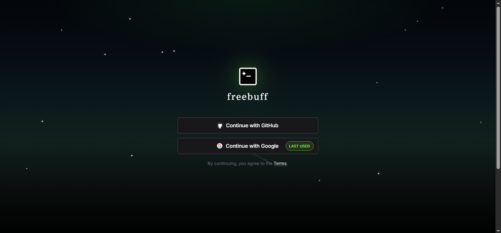

### Langkah 4

Klik **CLI** lalu salin (copy) perintah yang muncul.

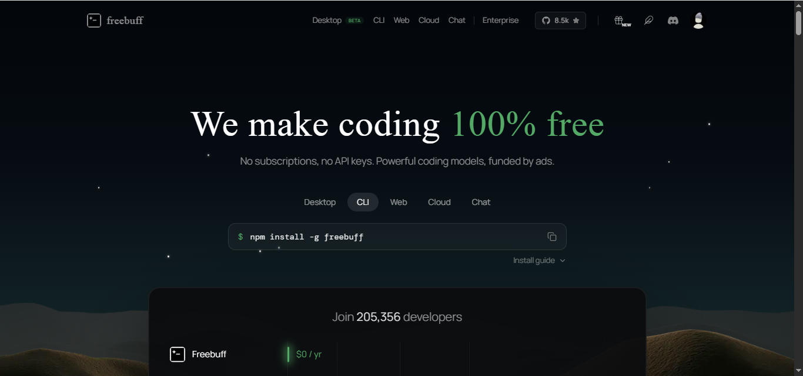

### Langkah 5

Buka CMD pada laptop atau komputer, dengan cara klik tombol Windows di keyboard lalu ketik `CMD`.

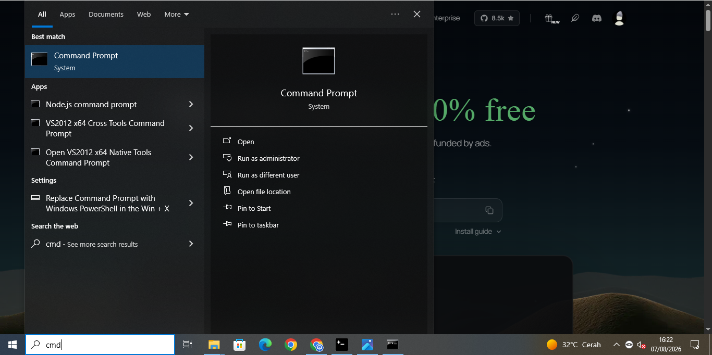

### Langkah 6

Cek terlebih dahulu apakah kamu sudah memiliki [Node.js](https://nodejs.org) atau belum. Ketik:

```bash
npm -v
```

Lalu klik Enter. Jika keluar angka versinya, berarti sudah memiliki Node.js. Jika tidak, download terlebih dahulu melalui website resmi [nodejs.org](https://nodejs.org).

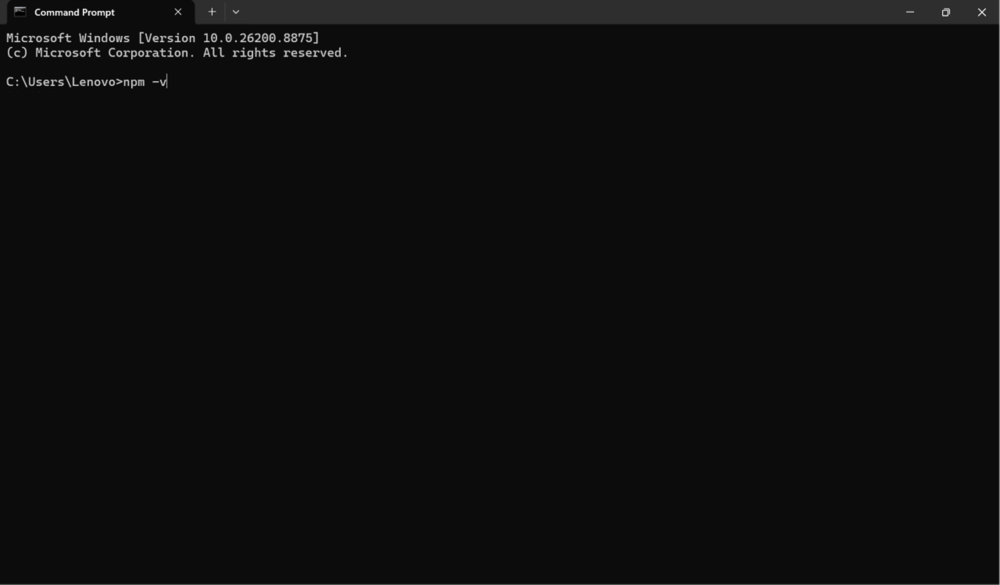

### Langkah 7

Jika sudah terinstal Node.js, paste perintah dari [Langkah 4](#cara-pakai-via-cli) yang sudah kamu copy tadi ke terminal, lalu klik Enter. Tunggu sampai selesai.

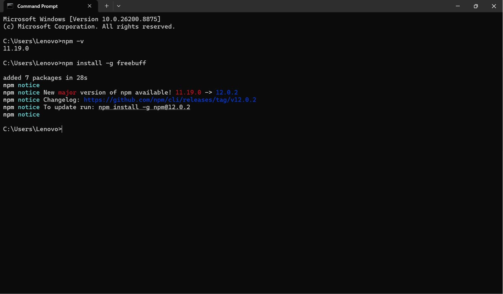

### Langkah 8

Ketik perintah berikut di terminal:

```bash
freebuff
```

Lalu klik Enter.

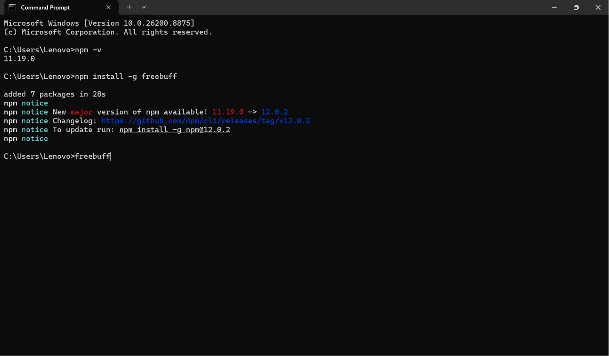

### Langkah 9

Ketika sudah berada di halaman freebuff, pilih folder untuk menyimpan file yang akan dibuat. Jika sudah, klik **Open**.

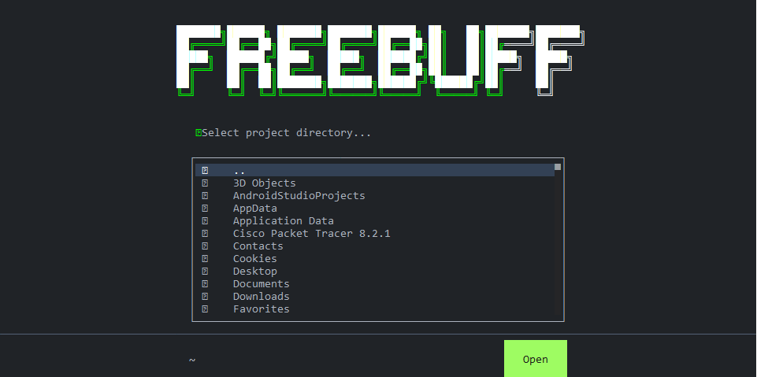

### Langkah 10

Klik bagian **Recommended** pada menu pertama.

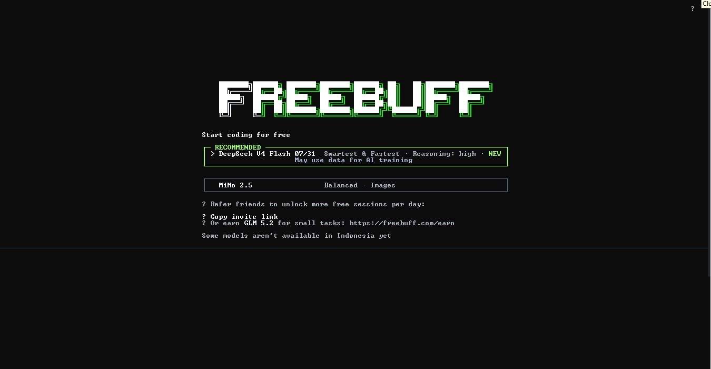

### Langkah 11

Masukkan prompt yang diinginkan.

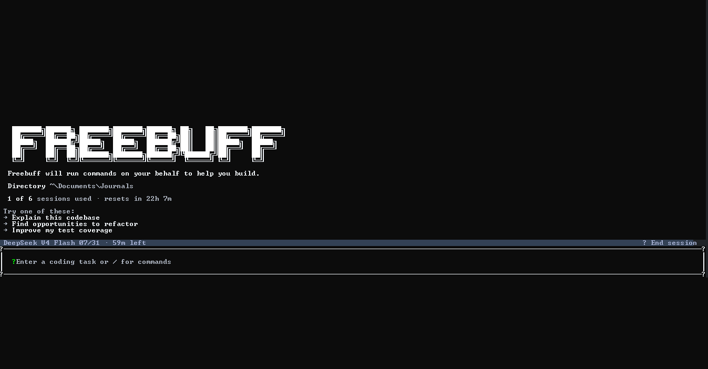

### Langkah 12

Sebagai contoh, ketik:

```bash
buatkan code untuk kalkulator
```

Lalu klik Enter.

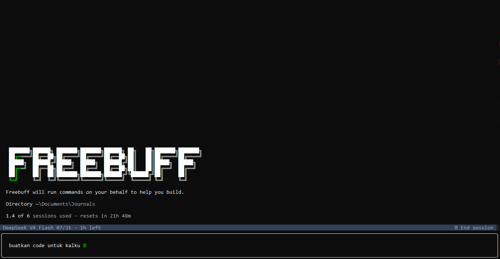

### Langkah 13

Jawab pertanyaan yang diberikan sesuai keinginanmu, lalu klik **Submit**. Tunggu hingga selesai.

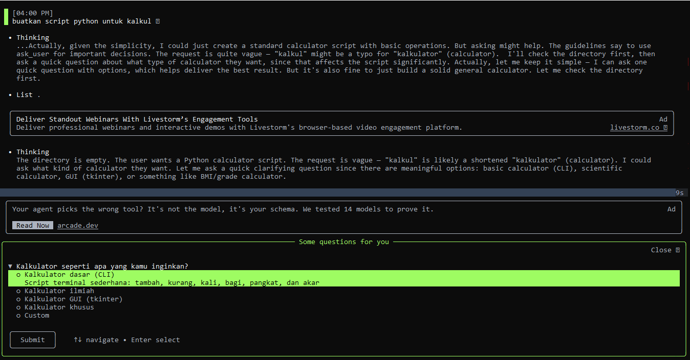

### Hasil Akhir

Scroll sedikit ke atas untuk melihat nama file yang dibuat oleh freebuff. Buka folder yang kamu pilih tadi, dan file kamu sudah selesai dibuat.

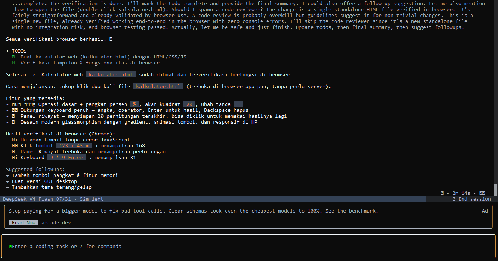

## Cara Pakai via Desktop

### Langkah 1

Buka browser favoritmu, cari freebuff, lalu klik website [freebuff.com](https://freebuff.com).

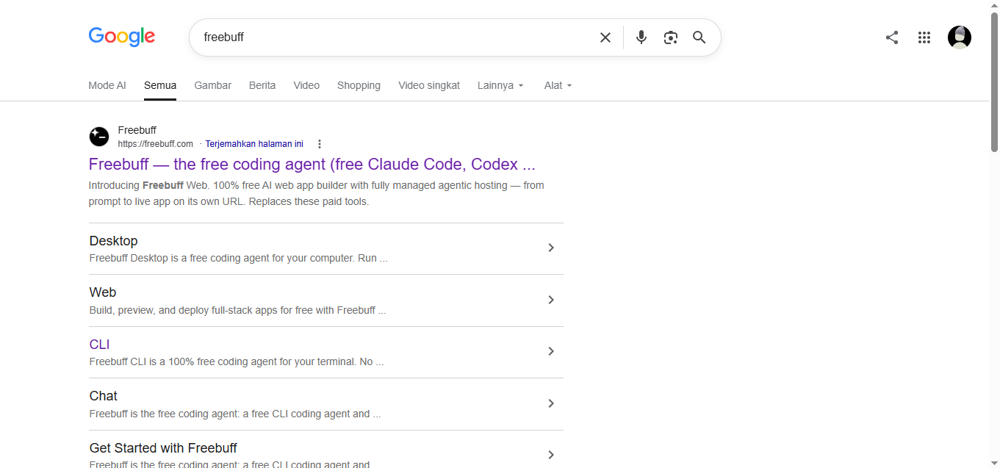

### Langkah 2

Lakukan sign in terlebih dahulu, klik **Sign in** di kanan atas.


### Langkah 3

Lakukan sign in menggunakan akun [Google](https://google.com) atau [GitHub](https://github.com).


### Langkah 4

Pilih yang **Desktop**, klik **Download**, lalu simpan di folder Download.

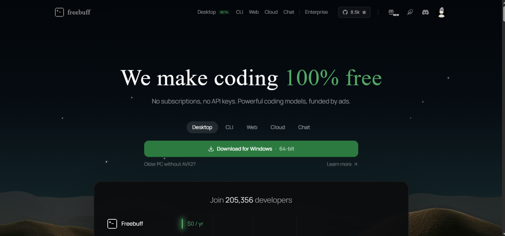

### Langkah 5

Buka folder Download, lalu klik file yang telah diunduh. Tunggu hingga selesai.

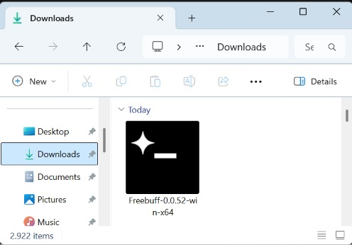

### Langkah 6

Lakukan sign in terlebih dahulu. Jika sudah, klik ikon **+** di kanan atas, lalu pilih folder untuk menyimpan file.

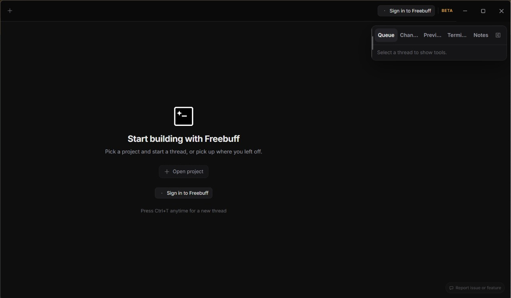

### Langkah 7

Masukkan prompt yang kamu inginkan. Sebagai contoh:

```bash
buatkan code untuk kalkulator
```

Lalu klik Enter, dan tunggu hingga selesai.

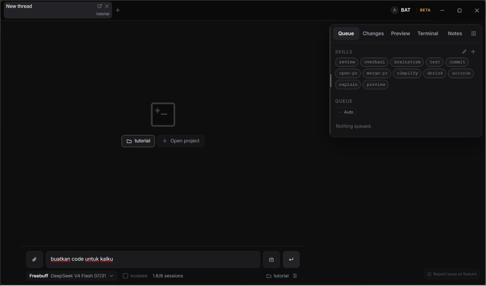

### Hasil Akhir

Hasil prompt kamu sudah selesai dibuat.

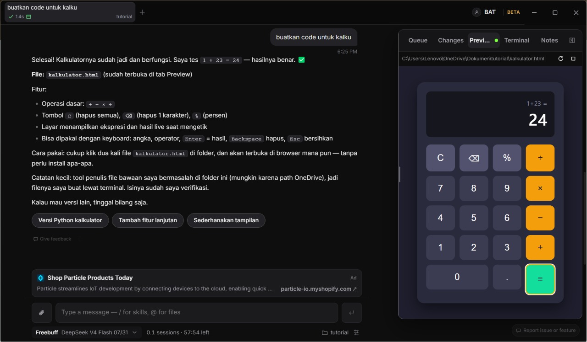

## Error yang Mungkin Muncul

- **Tidak bisa instal freebuff di terminal**: berarti belum memiliki Node.js. Solusinya, download Node.js terlebih dahulu melalui website resmi [nodejs.org](https://nodejs.org).
